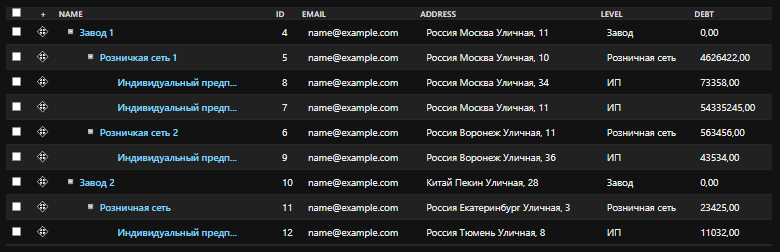
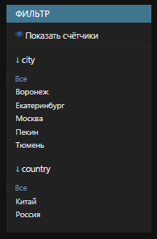
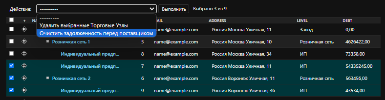

# Модель сети по продаже электроники

Веб-приложение с API-интерфейсом и админ-панелью. Сеть состоит из трех уровней: завод, розничная сеть и индивидуальные предприниматели. Каждое звено имеет только одного поставщика оборудования. Уровень определяется отношением к остальным элементам сети - завод на уровне 0, прямая связь розничной сети с заводом - уровень 1.

# Содержание

- [Модель сети по продаже электроники](#модель-сети-по-продаже-электроники)
  - [Содержание](#содержание)
  - [Запуск](#запуск)
    - [Docker](#docker)
    - [Стандартный](#стандартный)
  - [Реализованный функционал](#реализованный-функционал)  
    - [Модель сети](#модель-сети)
    - [Админ панель](#админ-панель)
    - [DRF и набор представлений](#drf-и-набор-представлений)
      - [Получение токена](#post-apitoken)
      - [Список узлов](#get-apinetworknodes)
      - [Детали узла](#get-apinetworknodes4)
      - [Создание узла](#post-apinetworknodes)
      - [Обновление узла](#put-apinetworknodes4)
      - [Частичное изменение узла](#patch-apinetworknodes4)
      - [Удаление узла](#delete-apinetworknodes4)
  - [Технологии](#технологии)

# Запуск

Склонируйте репозиторий и перейдите в директорию проекта

Приложение можно развернуть при помощи Docker или стандартным способом

## Docker

В корне проекта выполните команду

```sh
$ docker compose up -d
```

Перейдите на <http://localhost:8000/>

В базе данных уже будет находиться базовый набор данных и два пользователя:

Администратор (username: admin, password: admin)

Обычный пользователь  (username: user, password: user12345)

## Стандартный

1 Создайте виртуальное окружение и активируйте его:

   ```shell
   $ python3 -m venv venv
   ```

   ```shell
   $ source venv/bin/activate
   ```

2 Установите зависимости:

   ```shell
   $ pip3 install -r requirements.txt
   ```

3 Измените файл <*template.env*> на <*.env*> и подставьте ваши значения и данные для подключения к вашей базе данных

4 Переход в директорию:

   ```shell
   $ cd electronics_retailer
   ```

6 Примените миграции:

   ```shell
   $ python3 manage.py migrate
   ```

7 Загрузка фикстур:

  ```shell
  $ python3 manage.py loaddata fixtures/data.json
  ```

8 Запуск приложения:

   ```shell
   $ python3 manage.py runserver
   ```

Перейдите на <http://localhost:8000/>

В базе данных уже будет находиться базовый набор данных и два пользователя:

Администратор (username: admin, password: admin)

Обычный пользователь  (username: user, password: user12345)

# Реализованный функционал

Здесь находится описание всей проделанной работы

## Модель сети

Каждое звено сети ссылается только на одного поставщика оборудования (не обязательно предыдущего по иерархии). Важно отметить, что уровень иерархии определяется не названием звена, а отношением к остальным элементам сети, т. е. завод всегда находится на уровне 0, а если розничная сеть относится напрямую к заводу, минуя остальные звенья, ее уровень — 1.

Система считает, что узел у которого нет поставщика это "завод", узел который не является поставщиком "индивидуальный предприниматель", а узел который является поставщиком и у которого есть поставщик "розничная сеть"

Пример сети



Каждое звено сети обладает:

- Названием
- email
- страной
- городом
- улицей
- номером дома
- Продуктами:
  - названием
  - моделью
  - датой выхода продукта на рынок
- Поставщиком (предыдущий по иерархии объект сети)
- Задолженностью перед поставщиком в денежном выражении с точностью до копеек.
- Временем создания (заполняется автоматически при создании).

## Админ панель

### Ссылка на «Поставщика»


Удобная структура в админ панели позволяет легко найти поставщика любого узла и наглядно увидеть иерархию поставок

### Фильтр по названию города

Реализована фильтрация по названию города



### Admin action, очищающий задолженности

Добавлен admin action, который очищает задолженности у всех выбранных узлов



## DRF и набор представлений

Настроить права доступа к API так, чтобы только активные сотрудники имели доступ к API.

Регистрация реализована через JWT

### POST /api/token/

Пример запроса

```
POST /api/token/
```

```JSON
{
    "username": "admin",
    "password": "admin"
}
```

Пример ответа

```JSON
{
    "refresh": "refresh-token",
    "access": "access-token"
}
```

Неактивный пользователь не может получить токен или обращаться к API. Параметры пользователей можно настроить в панели администратора

Реализован CRUD для модели поставщика (запрещено обновление через API поля «Задолженность перед поставщиком»).

### GET /api/networknodes/

Пример запроса

```
GET /api/networknodes/
```

Пример ответа

```JSON
[
    {
        "id": 4,
        "name": "Завод 1",
        "email": "name@example.com",
        "country": "Россия",
        "city": "Москва",
        "street": "Уличная",
        "house_number": "11",
        "debt": 0.0,
        "products": [],
        "level": "Завод",
        "created_at": "2024-07-26T14:34:37.329000Z",
        "supplier": null
    },
    {
        "id": 5,
        "name": "Розничкая сеть 1",
        "email": "name@example.com",
        "country": "Россия",
        "city": "Москва",
        "street": "Уличная",
        "house_number": "10",
        "debt": 4626422.0,
        "products": [
            {
                "id": 1,
                "name": "1",
                "model": "1111",
                "release_date": "2024-07-26"
            }
        ],
        "level": "Розничная сеть",
        "created_at": "2024-07-26T14:35:35Z",
        "supplier": {
            "id": 4,
            "name": "Завод 1",
            "email": "name@example.com",
            "country": "Россия",
            "city": "Москва",
            "street": "Уличная",
            "house_number": "11",
            "level": "Завод"
        }
    },
]
```

### GET /api/networknodes/4/

Пример запроса

```
GET /api/networknodes/4/
```

Пример ответа

```JSON
{
    "id": 4,
    "name": "Завод 1",
    "email": "name@example.com",
    "country": "Россия",
    "city": "Москва",
    "street": "Уличная",
    "house_number": "11",
    "debt": 0.0,
    "products": [],
    "level": "Завод",
    "created_at": "2024-07-26T14:34:37.329000Z",
    "supplier": null
}
```

---

### POST /api/networknodes/

Пример запроса

```
POST /api/networknodes/
```

```JSON
{
    "name": "ИП",
    "email": "name@example.com",
    "country": "Россия",
    "city": "Москва",
    "street": "Уличная",
    "house_number": "12",
    "products": [
        1, 2
    ],
    "supplier_id": 4
}
```

supplier_id отвечает за то кто будет поставщиком для этого узла, если параметра нет, то узел становиться заводом

Пример ответа

```JSON
{
    "id": 14,
    "name": "ИП",
    "email": "name@example.com",
    "country": "Россия",
    "city": "Москва",
    "street": "Уличная",
    "house_number": "12",
    "debt": 0.0,
    "products": [
        {
            "id": 1,
            "name": "1",
            "model": "1111",
            "release_date": "2024-07-26"
        },
        {
            "id": 2,
            "name": "2",
            "model": "2222",
            "release_date": "2024-07-26"
        }
    ],
    "level": "ИП",
    "created_at": "2024-07-26T19:11:32.190937Z",
    "supplier": {
        "id": 4,
        "name": "Завод 1",
        "email": "name@example.com",
        "country": "Россия",
        "city": "Москва",
        "street": "Уличная",
        "house_number": "11",
        "level": "Завод"
    }
}
```

После создания поставщика можно изменить только в админ панели

---

### PUT /api/networknodes/4/

Пример запроса

```
PUT /api/networknodes/4/
```

```JSON
{
    "name": "Завод 1",
    "email": "name@example.com",
    "country": "Россия",
    "city": "Москва",
    "street": "Уличная",
    "house_number": "3",
    "products": [1, 2]
}
```

Пример ответа.

```JSON
{
    "id": 4,
    "name": "Завод 1",
    "email": "name@example.com",
    "country": "Россия",
    "city": "Москва",
    "street": "Уличная",
    "house_number": "3",
    "debt": 0.0,
    "products": [
        {
            "id": 1,
            "name": "1",
            "model": "1111",
            "release_date": "2024-07-26"
        },
        {
            "id": 2,
            "name": "2",
            "model": "2222",
            "release_date": "2024-07-26"
        }
    ],
    "level": "Завод",
    "created_at": "2024-07-26T14:34:37.329000Z",
    "supplier": null
}
```

---

### PATCH /api/networknodes/4/

Пример запроса

```
PATCH /api/networknodes/4/
```

```JSON
{
    "country": "США"
}
```

Пример ответа

```JSON
{
    "id": 4,
    "name": "Завод 1",
    "email": "name@example.com",
    "country": "США",
    "city": "Москва",
    "street": "Уличная",
    "house_number": "3",
    "debt": 0.0,
    "products": [
        {
            "id": 1,
            "name": "1",
            "model": "1111",
            "release_date": "2024-07-26"
        },
        {
            "id": 2,
            "name": "2",
            "model": "2222",
            "release_date": "2024-07-26"
        }
    ],
    "level": "Завод",
    "created_at": "2024-07-26T14:34:37.329000Z",
    "supplier": null
}
```

---

### DELETE /api/networknodes/4/

Пример запроса

```
DELETE /api/networknodes/4/
```

При удалении узла, все узлы для которых он был поставщиком, связываются с его поставщиком, или перемещаются нв уровень 0, если у узла не было поставщика

# Технологии

- #### Python 3.11.6

- #### Django 5.0.7

- #### DRF 3.15.2

- #### Postgres 16.2

- #### Docker 27.0.3
